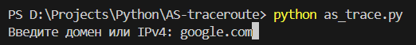
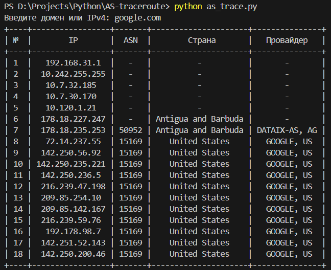

# Трассировка автономных систем
Данная утилита позволяет выполнять трассировку автономных систем, получая их ASN (Autonomous System Number), информацию о стране, в которой они находятся и интернет-провайдера.

---

## Реализовано:
- **Трассировка:** Программа получает список маршрутизаторов, по которым пройдёт пакет по пути к целевому узлу.
- **ASN:** Для "белых" IP-адресов указывается номер автономной системы, страна и провайдер.
- **Кросплатформенность:** Программа поддерживает Windows и Linux.
- **Обработка ошибок:**
  - Неподдерживаемая ОС.
  - Отсутствие интернет-соединения.
  - Не указан домен или IP-адрес.
  - Проверка "серых" адресов.
  - Невозможность разрешения доменного имени.
  - Ошибки трассировки.
  - Ошибки WHOIS.

---

## Установка и использование
0. Если вы используете Linux, убедитесь, что установлен `traceroute`.
**Ubuntu/Debian:** `sudo apt install traceroute`
**Fedora:** `sudo dnf install traceroute`
**Arch:** `sudo pacman -S traceroute`

1. Установите необходимые зависимости: `pip install -r requrements.txt`

2. Запустите программу: `python as_trace.py` или `python3 as_trace.py`

3. Введите домен или IP-адрес (v4), для которого нужно выполнить трассировку:

4. Программа выведет необходимую информацию или сообщение об ошибке:

